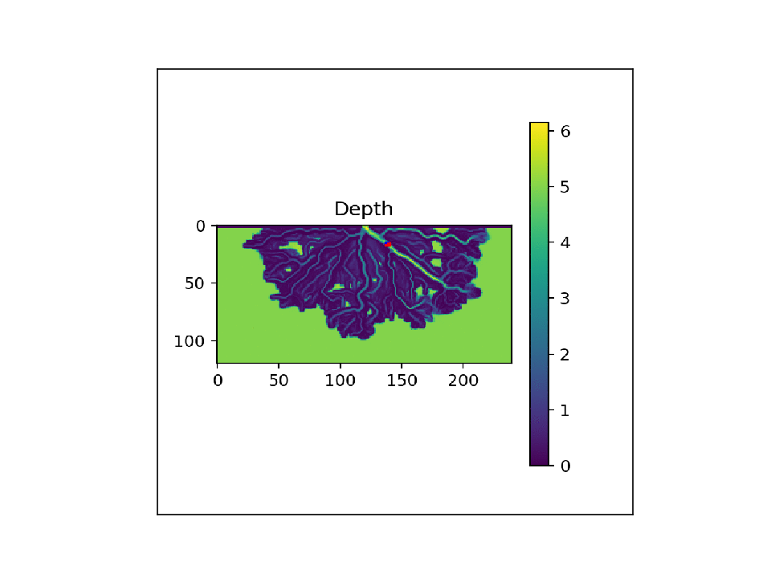
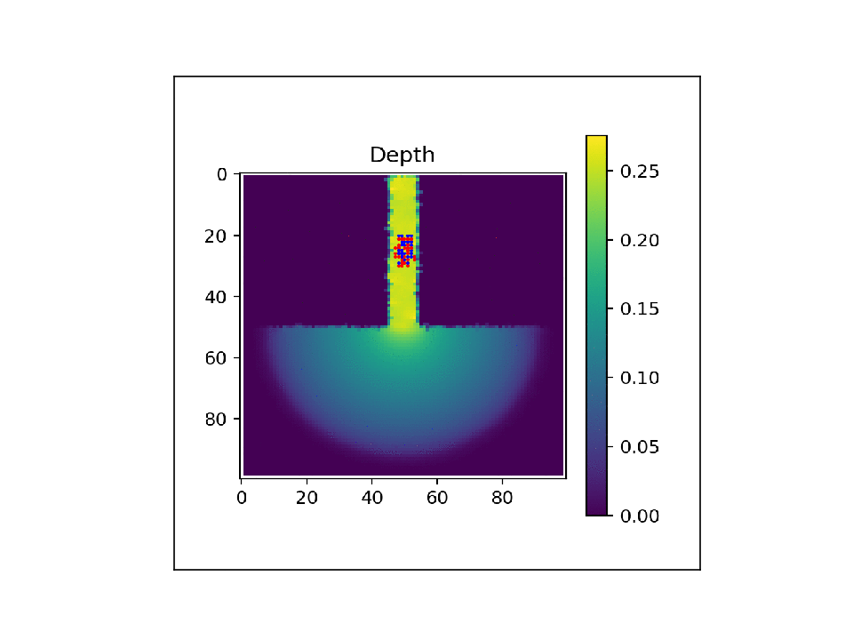

# ParticleRouting

v1.00

Lagrangian particle routing via weighted random walks.

## Dependencies and Installation
### Dependencies:
- numpy
- matplotlib
- scipy
- tqdm
- (optional) requires the 'ffmpeg' writer to use the animate_plots routine

### Installation:
(tested on Ubuntu)
- Clone the repository
- From the cloned folder, run `python setup.py install` to install most of package (will run into error related to Python2.7 retirement)
- Then run `pip install particlerouting` to finish installing the package

### Example Use:
See the python scripts provided in the examples folder.

## Example Results:
Initial particle locations indicated by blue dots, active/evolving particle locations shown as red dots.

### Particles on a DeltaRCM Simulated Delta

    </a>

### Particles on a ANUGA Hydro generated flow field

    </a>

## Documentation
For more thorough documentation, see (add link to compiled docs github page)
