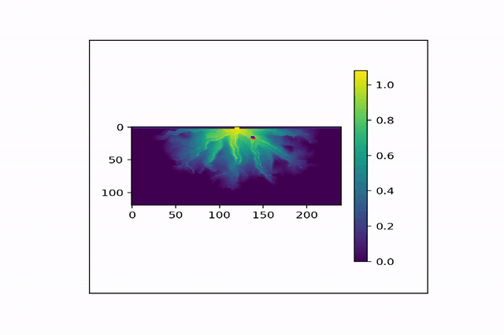
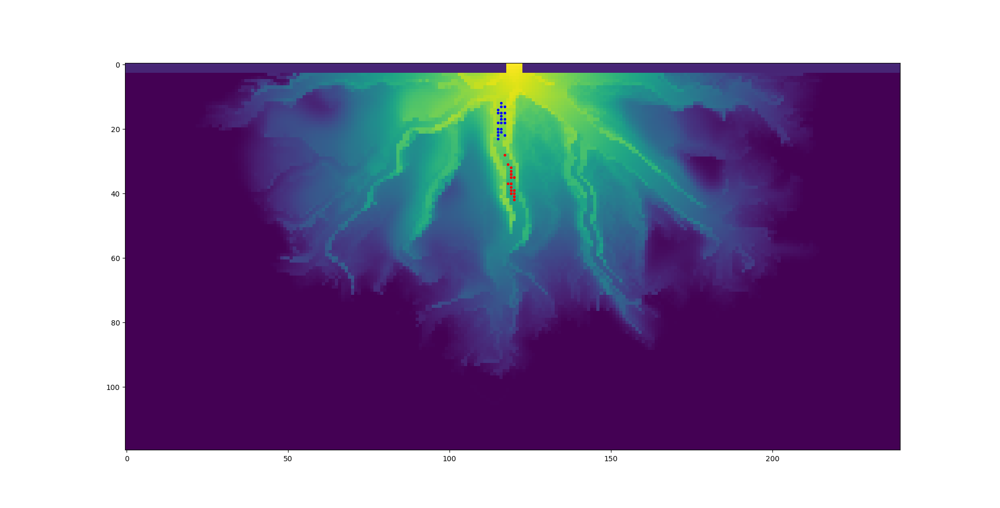

# ParticleRouting

v1.0

Lagrangian particle routing via weighted random walks.

## Dependencies and Installation
### Dependencies:
- numpy
- matplotlib
- scipy
- netcdf4
### Installation:
- Clone the repository
- From the cloned folder, run `pip install particlerouting` to install the package

### Example Use:
See either the example [jupyter notebook](examples/deltarcm_particles.ipynb) or the example [python script](examples/test_case.py).

## Example Results
Initial particle locations indicated by blue dots, final particle locations shown as red dots. Particles plotted on depth grid from a DeltaRCM simulation (example output provided in examples folder)

### Example 1

    </a>

### Example 2

## Documentation
To be added. Code is thoroughly commented at this time. The weighting scheme for the random walk follows the method described in [1] and [2] for reduced complexity modeling of Lagrangian hydrodynamics. 

## References
[1] Liang, M., Vaughan R. Voller, and Chris Paola. "A reduced-complexity model for river delta formation-Part 1: Modeling deltas with channel dynamics." Earth Surface Dynamics 3.1 (2015).

[2] Liang, M., et al. "A reduced-complexity model for river delta formation-Part 2: Assessment of the flow routing scheme." Earth Surface Dynamics 3.1 (2015): 87.
