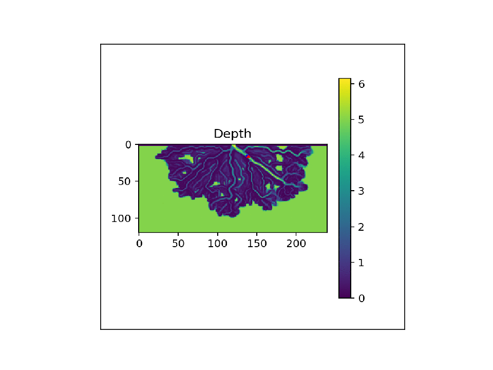
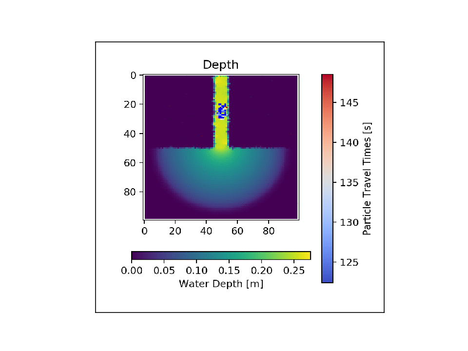

.. _examples:

========
Examples
========

Examples contained in the ParticleRouting/examples folder include the following:

steady_anuga_particles
----------------------
add link to script

Example of particle routing on a simple flow field generated using ANUGA Hydro.

.. image:: images/steady_anuga.gif
    :width: 800px
    :align: center

steady_deltarcm_particles
-------------------------
add link to script

Example of particle routing on a numerically generated river delta created using DeltaRCM.

.. image:: images/steady_deltarcm.gif
    :width: 800px
    :align: center

animate_deltarcm_particles
--------------------------
add link to script

An example script showing how to use the animate_plots routine to generate videos of the particle movement like those shown on this page.

steepest_descent_deltarcm
-------------------------
add link to script

An example script showing how the randomness can be turned off and a 'steepest descent' routing of the particles can be done by only allowing particles to travel to the neighboring cell with the greatest weight. 

timing_anuga_particles
----------------------
add link to script

An example script which shows how the individual particle travel times can be visualized by coloring the particles themselves.

true_random_walk
----------------
add link to script

An example script showing that by making the depth uniform, and setting the water discharge and both random walk parameters to 0, the particles move in a true random walk again.

.. image:: images/random_walk.gif
    :width: 800px
    :align: center

set_timestep_anuga_particles
----------------------------
add link to script 

An example script showing how the timestep can be prescribed and the particles will all continue routing until their respective travel times are all close to the target timestep duration. Initial particle locations are shown as blue dots, and red dots indicate the final particle locations after they have all travelled for about 2100 seconds.

.. image:: images/Set_Timestep.png
    :width: 800px
    :align: center

Example Output:

::

   Prescribed target travel time: 2100 seconds
   List of particle travel times for final particle locations: [2065. 2111. 1978. 2081. 2150. 2031. 2055. 2108. 2151. 2110. 1955. 1942.
                                                                2113. 2135. 2045. 2069. 2112. 2074. 2126. 2136. 2003. 2130. 2090. 2098.
                                                                2136. 2079. 2068. 2076. 2064. 2033. 2091. 2087. 2071. 2070. 2066. 2005.
                                                                2073. 2134. 2126. 2058. 2149. 2118. 2145. 1956. 2122. 2112. 2122. 2114.
                                                                2132. 2126.]

parallel_comparison
-------------------
add link to script

This script is meant to provide an example of the local parallelization. This functionality has been tested on Ubuntu 18.04, and may not work on Windows due to the ways in which Python handles multiple processes and the global lock. In this script, 2 cores are compared to running the same process in serial and an approximate 2x speed-up was achieved in this small case by using the parallel option.
