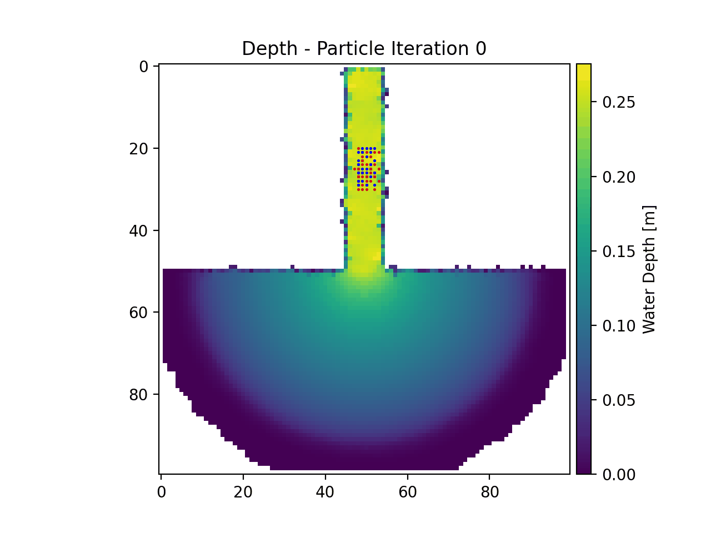

.. _example01:

Example 1 - Particles in Steady Flow (ANUGA)
============================================

In this example, particles movement is simulated on gridded `ANUGA <https://github.com/GeoscienceAustralia/anuga_core>`_ model output. The case is flow from a channel into an empty basin, and the flow field is static, or steady in time for this example.

The full example script is available :download:`here <../../../examples/steady_anuga_particles.py>`.

First the variables from the ANUGA model must be loaded, the example data for this case is provided in the "examples/" directory of the repository.

.. doctest::

   >>> import numpy as np
   >>> from dorado.routines import steady_plots
   >>> import dorado.particle_track as pt
   >>> data = np.load('ex_anuga_data.npz')
   >>> depth = data['depth']
   >>> qx = data['qx']
   >>> qy = data['qy']

Next the `dorado` parameter object must be defined and the domain as well as the particle properties must be established. For this example there is no defined stage data, so the depth values will be used instead. First the domain properties will be established.

.. doctest::

   >>> params = pt.modelParams()

   >>> params.stage = depth  # don't have stage data in example
   >>> params.depth = depth
   >>> params.qx = qx
   >>> params.qy = qy
   >>> params.dx = 50.
   >>> params.model = 'Anuga'

Next the particle class will be defined and a set of particles will be generated.

.. doctest::

   >>> seed_xloc = list(range(20, 30))
   >>> seed_yloc = list(range(48, 53))
   >>> Np_tracer = 50
   >>> particles = pt.Particles(params)
   >>> particles.generate_particles(Np_tracer, seed_xloc, seed_yloc)

Then lastly the particle movement will be simulated for 50 iterations.

.. doctest::

   >>> walk_data = steady_plots(particles, 50, 'steady_anuga_example')

If we animate this simulation, the particle movement appears as the following:

