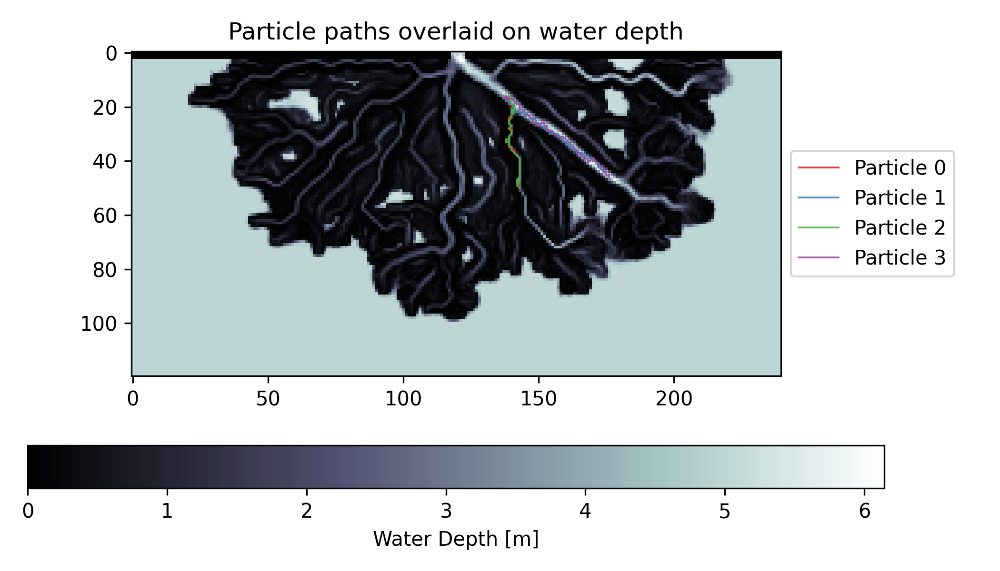

.. _example07:

Example 7 - Drawing Particle Travel Paths (DeltaRCM)
====================================================

In this example, we will use the particles movement simulated in :ref:`example02`, and visualize some of the particle travel paths.

Full example script available :download:`here <../../../examples/draw_deltarcm_particle_paths.py>`.

First run :ref:`example02`, and then we can access and use the particle travel information output by that example.

.. doctest::

   >>> import numpy as np
   >>> import json
   >>> import os
   >>> from dorado.routines import draw_travel_path
   >>> data = np.load('ex_deltarcm_data.npz')
   >>> depth = data['depth']
   >>> all_walk_data = json.load(open('steady_deltarcm_example'+os.sep+'data'+os.sep+'data.txt'))

Now we will apply the `draw_travel_path` function. In this example we are going to visualize the travel paths of the first 4 particles, indicated by the list we are providing to the `draw_travel_path` function. We will show every 4th iteration to visually simplify the path, controlled by `interval` parameter.

.. doctest::

   >>> draw_travel_path(depth, all_walk_data, [0, 1, 2, 3],
   >>>                  'steady_deltarcm_example'+os.sep+'figs'+os.sep+'travel_paths.png',
   >>>                  interval=4, plot_legend=True)

