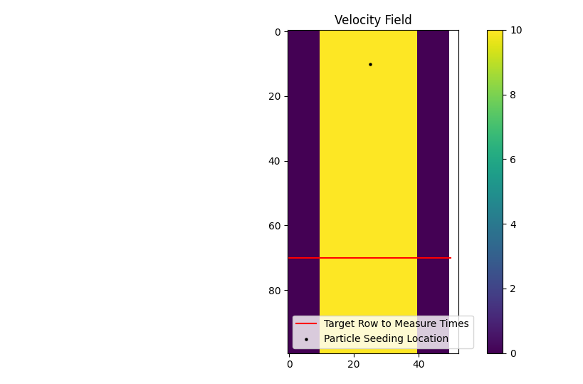
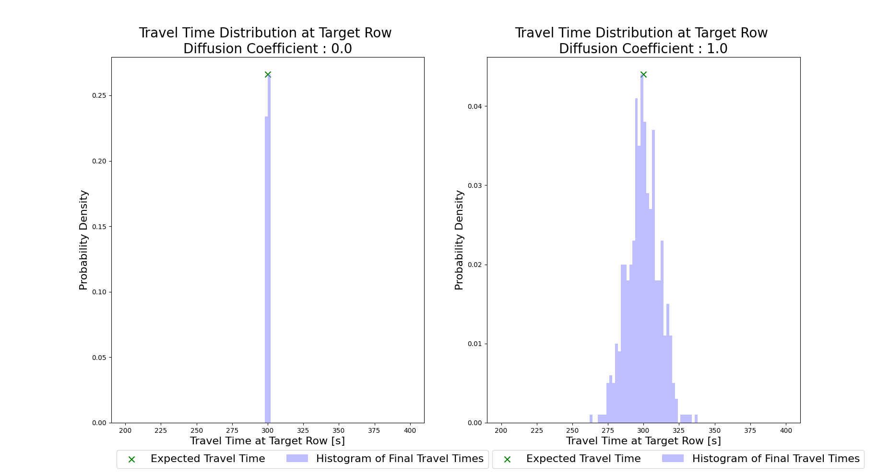

.. _example11:

Example 11 - The Travel Time Diffusion Coefficient
==================================================

In this example, we will develop a simple straight channel with steady, uniform flow. Then we will use two different travel time diffusion coefficient values (`diff_coeff`) and look at the impact on the particle travel time distributions at a specific location.

Shortened code for the synthetic channel creation will be provided, for the full code refer to the :download:`example script <../../../examples/traveltime_straight_channel.py>`.

.. doctest::

   >>> import numpy as np
   >>> import matplotlib.pyplot as plt
   >>> import particlerouting.particle_track as pt

   >>> domain = np.zeros((100, 50))
   >>> depth[:, 10:40] = 1.0
   >>> v[:, 10:40] = -10.0

In the 100 x 50 cell domain, we have a straight channel with flow from the top of the domain to the bottom at -10 m/s. Our cell size is 50m, and the particles will be seeded at row 10. At row 70, we will measure their travel times. Since the flow velocity is both steady and uniform in this channel, our expected travel time is simply:

.. math::
   :nowrap:

   \begin{eqnarray}
   {\text{Exp. Time} = 60 \text{ cells} \times 50 \text{ m/cell} \div 10 \text{ m/s} = 300 \text{ seconds}}`.
   \end{eqnarray}

With this in mind we will conduct two simulations, both using 500 tracer particles. In the first, we will set the travel time diffusion coefficient (`diff_coeff`) to 0, and in the second we will set it to 1.0 (a significant amount of added diffusivity).

Shortened parameter initialization:

.. doctest::

   >>> params = pt.params()
   >>> params.depth = depth
   >>> params.v = v
   >>> params.dx = dx
   ...

Then we will define `diff_coeff`, initialize the Particle class, and do the simulation.

.. doctest::

   >>> for dc in range(0, 2):
   >>>    # set diff_coeff
   >>>    if dc == 0:
   >>>        params.diff_coeff = 0.0
   >>>    else:
   >>>        params.diff_coeff = 1.0
   
   >>>    # make particle
   >>>    particle = pt.Particle(params)

   >>>    # walk it
   >>>    walk_data = None
   >>>    for i in list(range(0, num_iter)):
   >>>        walk_data = particle.run_iteration(previous_walk_data=walk_data)

If we then visualize the two travel time distributions (shown below), we can see the impact of raising the `diff_coeff`. If you'd like to experiment with this scenario, the full example script includes the code for generating the plots shown below.

