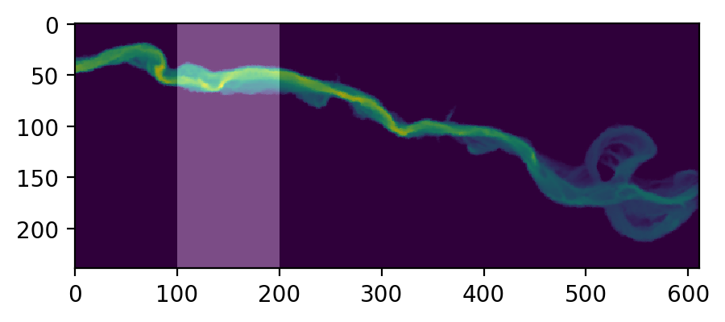
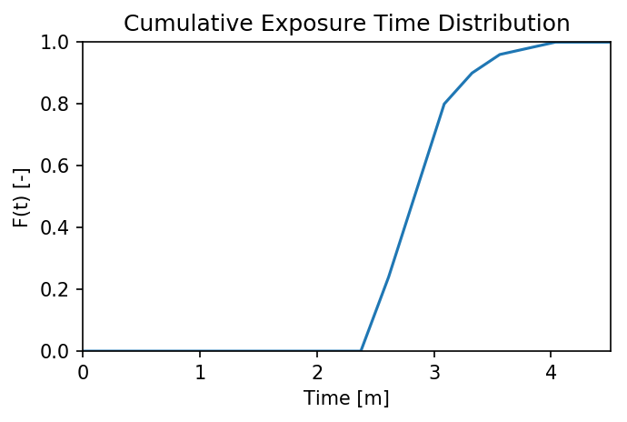
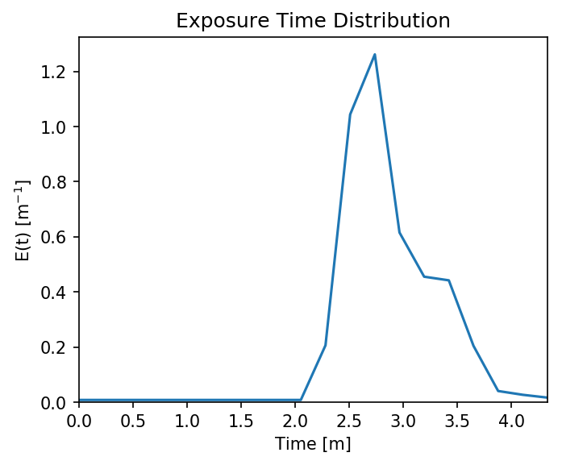

.. _example13:

Example 13 - Using Unstructured Grids
=====================================

This workbook provides an example workflow for running particles on an
unstructured model output (i.e. flow variables are from a non-Cartesian
grid). We make use of several of the geospatial functions in
``particle_track.py`` and others in ``routines.py``, in order to show
how to grid hydrodynamic input files, convert UTM coordinates into (and
out of) the array coordinates used in routing the particles, as well as
how to compute exposure times to a region of interest. Hopefully this
example in conjunction with other examples can provide information on
how users can adapt these codes to their use-case.

Full example workbook available :download:`here <../../../examples/unstructured_grid_anuga.ipynb>`.

To demonstrate this functionality, we make use of outputs from the
hydrodynamic model `ANUGA <https://github.com/GeoscienceAustralia/anuga_core>`_,
which solves the 2D shallow-water equations on a triangular mesh. We’ve
extracted outputs from a previous example model run and included these
as text files in the repository, so as to avoid importing any
dependencies not required by this distribution. If the user is also
using ANUGA flow-fields, there is a a commented-out block of code below
demonstrating how we extracted the input files for use in this workbook.

Import necessary dependencies
~~~~~~~~~~~~~~~~~~~~~~~~~~~~~

.. code:: ipython

    import numpy as np
    import scipy
    import matplotlib
    %matplotlib inline
    from matplotlib import pyplot as plt
    import json
    import dorado
    from dorado import particle_track as pt
    from dorado import routines

Load in model outputs
~~~~~~~~~~~~~~~~~~~~~

If we were starting directly from an ANUGA output file, this is where we
would import the outputs from the model run. We have included these
files directly with the distribution, but for anyone interested in
repeating the steps we used to generate these files, uncomment the block
of code below.

Here, ``path2file`` should point to the ANUGA output file
(e.g. ``./model_output.sww``). This output is a NetCDF file with flow
variables (e.g. ``depth``, ``xmom``, ``stage``) listed by triangle
index, along with the centroid coordinates (``x``, ``y``) of that
triangle. In our case, those coordinates are in meters UTM, which will
be relevant later.

.. code:: ipython

    # # Import anuga to access functions (NOTE: Anuga requires Python 2.7!)
    # import anuga

    # # Folder name of run to analyze:
    # path2file = 'examples/example_model.sww'

    # # Extract the files from NetCDF using Anuga's `get_centroids` function:
    # swwvals = anuga.utilities.plot_utils.get_centroids(path2file, timeSlices = 'last')
    # # Query values: time, x, y, stage, elev, height, xmom, ymom, xvel, yvel, friction, vel, etc

    # # Here, since we are only interested in saving variables, we migrate variables to a dictionary:
    # # Make sure to filter out NaN's before converting to lists, if there are any
    # unstructured = dict()
    # unstructured['x'] = swwvals.x.tolist()
    # unstructured['y'] = swwvals.y.tolist()
    # unstructured['depth'] = swwvals.height[0].tolist()
    # unstructured['stage'] = swwvals.stage[0].tolist()
    # unstructured['qx'] = swwvals.xmom[0].tolist()
    # unstructured['qy'] = swwvals.ymom[0].tolist()

    # # And then we save this dictionary into a json (text) file for later import
    # json.dump(unstructured, open('unstructured_model.txt', 'w'))
    # # This generates the file imported in this workbook

Here, we will skip the above step and just import the
``unstructured_model.txt`` dictionary.

**Note**: We have chosen to save/import the variables ``depth``,
``stage``, ``qx``, and ``qy`` in this application. However, we could
have chosen to save and use the fields ``topography``, ``u``, and ``v``
(or in ANUGA’s terminology, ``elev``, ``xvel``, and ``yvel``). The
particle tracking code accepts any of these inputs, as long as you
provide enough information to calculate the water surface slope, depth
of the water column, and the two components of inertia.

.. code:: ipython

    unstructured = json.load(open('unstructured_model.txt'))

Convert data and coordinates for particle routing
~~~~~~~~~~~~~~~~~~~~~~~~~~~~~~~~~~~~~~~~~~~~~~~~~

Now that we have the data we need, we can convert it into the format
needed by ``dorado``. This will include gridding the
hydrodynamic outputs and transforming our geospatial coordinates into
“array index” coordinates.

First, let’s combine our :math:`(x,y)` coordinates into a list of
tuples. This is the expected format for coordinates in the following
functions.

.. code:: ipython

    # Use list comprehension to convert into tuples
    coordinates = [(unstructured['x'][i], unstructured['y'][i]) for i in list(range(len(unstructured['x'])))]

    # Let's see the extent of our domain
    print(min(unstructured['x']), max(unstructured['x']),
          min(unstructured['y']), max(unstructured['y']))
    # As well as our number of data points
    print(len(unstructured['x']))

.. parsed-literal::

    (624422.25, 625031.9375, 3346870.0, 3347107.75)
    103558

Now, let’s grid our unstructured data into a uniform grid. For this, we
make use of the function ``particle_track.unstruct2grid()``, which uses
inverse-distance-weighted interpolation to create a Cartesian grid the
same size as our model’s extent. To use this function, we need to
provide: - Our list of ``coordinates`` (as tuples). - The unstructured
data we want to be gridded (here we start with ``depth``). - The desired
grid size of the resulting rasters (here we’re using :math:`1 m`,
because the test model was on high-resolution lidar data). - The
number of :math:`k` nearest neighbors to use in the interpolation. If
:math:`k=1`, we use only the nearest datapoint, whereas higher values
(default is :math:`k=3`) interpolate the data into a smoother result.

The underlying code relies on ``scipy`` to build a ``cKDTree`` of our
unstructured data, which maps the datapoints onto a uniform array.
``cKDTree`` is much faster than other gridding functions
(e.g. ``scipy.interpolate.griddata``), but building the tree can still
be very slow if the dataset is very large or if the desired grid size is
very small.

The outputs of ``unstruct2grid`` are: - The resulting interpolation
function ``myInterp`` (after building the nearest-distance tree), which
will be considerably faster than calling ``unstruct2grid`` again if we
are gridding additional datasets. This function assumes data have the
same coordinates, grid size, and :math:`k`. - A gridded array of our
data.

.. code:: ipython

    # Use IDW interpolation interpolate unstructured data into uniform grid
    myInterp, depth = pt.unstruct2grid(coordinates, unstructured['depth'], 1.0, 3)

    # Let's plot the resulting grid to see what the output looks like:
    plt.figure(figsize=(5,5), dpi=200)
    plt.imshow(depth, cmap='jet')
    plt.colorbar(fraction=0.018)
    plt.title('Gridded Depth Array')

.. image:: images/example13/unstructured_grid_anuga_10_1.png

Now, let’s use the new function ``myInterp`` to grid our additional
datasets. If ``unstruct2grid`` took a while to grid the first dataset,
this function will be considerably faster than re-running that process,
because it re-uses most of the results of that first function call. This
function only requires as input the new unstructured data to be gridded.

All of these variables will have the same grid size as the first
dataset, and we assume that they have all the same coordinates.

.. code:: ipython

    # Grid other data products with new interpolation function
    stage = myInterp(np.array(unstructured['stage']))
    qx = myInterp(np.array(unstructured['qx']))
    qy = myInterp(np.array(unstructured['qy']))
    # Should be very fast compared to the first dataset!

    # Let's plot one of these variables to see the new grid
    plt.figure(figsize=(5,5), dpi=200)
    plt.imshow(qy, vmin=-2, vmax=2, cmap='seismic')
    plt.colorbar(fraction=0.018)
    plt.title('Gridded Y-Discharge Array')

.. image:: images/example13/unstructured_grid_anuga_12_1.png

**Note:** In all these cases, if your unstructured data does not fill
the full rectangular domain, IDW interpolation may still populate those
exterior regions with data. If this has potential to cause problems when
routing particles, make sure to do some pre-processing on these rasters
to correct those exterior regions or crop the domain.

Now, let’s figure out where we want to seed our particles. If you’re
modeling a real domain, it may be easier to figure out a good release
location by opening some GIS software and finding the coordinates of
that location. Here, we will use the function
``particle_track.coord2ind()`` to convert your coordinates into array
indices. This function requires: - Coordinates to be converted, as a
list [] of :math:`(x,y)` tuples - The location of the lower left corner
of your rasters (i.e. the origin). If you used ``unstruct2grid`` to
generate rasters, this location will be ``[(min(x), min(y))]``.
Otherwise, if you’re loading data from e.g. a GeoTIFF, the lower left
corner will be stored in the .tif metadata and can be accessed by GIS
software or gdalinfo (if the user has GDAL) - The dimensions of the
raster, accessible via ``np.shape(raster)`` - The grid size of the
raster (here :math:`1m`).

**Note:** this coordinate transform flips the orientation of the unit
vectors (i.e. :math:`y_{index} = x` and :math:`x_{index} = -y`) and
returns raster indices. This is convenient for the internal
functions of ``particle_tools.py``, but may cause confusion with
plotting or interpreting later if locations are not translated back into
spatial coordinates. (Don’t worry, we will convert back later!)

We assume in all of these functions that the coordinates you’re using
are (at least locally) flat. We do not account for the curvature of the
Earth in very large domains. Hopefully you are using a projected
coordinate system (here we are using meters UTM), or at least willing to
accept a little distortion. Note that this ``coord2ind`` requires units
of either meters or decimal degrees.

.. code:: ipython

    # I have found a nice release location in GIS. Let's convert it to index notation:
    seedloc = [(624464, 3347078)] # Coordinates are in meters UTM

    # Call the coordinate transform function
    seedind = pt.coord2ind(seedloc,
                           (min(unstructured['x']),
                            min(unstructured['y'])),
                           np.shape(depth), 1.0)
    print(seedind)

    # Visualize the location on our array
    plt.figure(figsize=(5,5), dpi=200)
    plt.scatter(seedind[0][1], seedind[0][0], c='r')
    plt.imshow(depth)
    plt.colorbar(fraction=0.03)
    plt.title('Gridded Depth Array')
    plt.xlim([seedind[0][1]-40, seedind[0][1]+100])
    plt.ylim([seedind[0][0]+70, seedind[0][0]-30])

.. parsed-literal::

    [(31, 42)]

.. image:: images/example13/unstructured_grid_anuga_15_2.png

Set up particle routing parameters
~~~~~~~~~~~~~~~~~~~~~~~~~~~~~~~~~~

Now that we have pre-converted the input data we need, let’s set up the
particle routing to be run. We do this using the
``particle_track.params`` class, in which we populate the attributes to
suit our application. This includes the gridded hydrodynamic outputs
from above, the seed location, and other features of our particle
application (e.g. grid size ``dx``, number of particles ``Np_tracer``,
coefficients of the random walk).

.. code:: ipython

    # Create the parameters object and then assign the values
    params = pt.params()

    # Populate the params variables
    params.stage = stage
    params.depth = depth
    params.qx = qx
    params.qy = qy

    # Now we in the region +/- 1 cell of the seed location we computed earlier
    # Note that "xloc" and "yloc" are x and y in the particle coordinate system!
    params.seed_xloc = [seedind[0][0]-1, seedind[0][0]+1]
    params.seed_yloc = [seedind[0][1]-1, seedind[0][1]+1]

    # For this example, we model 50 particles:
    params.Np_tracer = 50

    # Other choices/parameters
    params.dx = 1. # Grid size
    params.dry_depth = 0.01 # 1 cm considered dry
    # You can also tell it which model you're using, but this only matters if the answer is DeltaRCM:
    params.model = 'Anuga'

In this application, we are using the default values for the parameters
of the random walk (``gamma``, ``theta``, ``diff_coeff``). I encourage
you to play with these weights and see how your solution is affected.

Run the particle routing
~~~~~~~~~~~~~~~~~~~~~~~~

Now we call on one of the routines, ``routines.steady_plots()``, to run
the model. The core of the particle routing occurs in the
``particle_track.run_iteration()`` function, but for ease of use, we
have provided several high-level wrappers for the underlying code in the
``routines.py`` script. These routines take common settings, run the
particle routing, and save a variety of plots and data for
visualization.

Because our model is a steady case (i.e. flow-field is not varying with
time), ``steady_plots`` will run the particles for an equal number of
iterations and return the travel history to us in the ``walk_data``
dict. This dict is organized into ``['xinds']``, ``['yinds']``, and
``['travel_times']``, which are then indexed by particle ID, and then
finally iteration number. (e.g. ``walk_data['xinds'][5][10]`` will
return the xindex for the 6th particle’s 11th iteration).

.. code:: ipython

    # Using steady (time-invariant) plotting routine for 200 iterations
    walk_data = routines.steady_plots(params, 200, 'unstructured_grid_anuga')
    # Outputs will be saved in the folder 'unstructured_grid_anuga'

.. parsed-literal::

    Theta parameter not specified - using 1.0
    Gamma parameter not specified - using 0.05
    Diffusion coefficient not specified - using 0.2
    Cell Types not specified - Estimating from depth
    Using weighted random walk
    Directories already exist

.. parsed-literal::

    100%|################################################################################| 200/200 [01:43<00:00,  1.94it/s]

Because the particles take different travel paths, at any given
iteration they are *not guaranteed* to be synced up in time. We can
check this using the ``routines.get_state()`` function, which allows us
to slice the ``walk_data`` dictionary along a given iteration number.
This function logically indexes the dict like
``walk_data[:][:][iteration]``, except not quite as simple given the
indexing rules of a nested list.

By default, this function will return the most recent step (iteration
number ``-1``), but we could ask it to slice along any given iteration
number.

.. code:: ipython

    xi, yi, ti = routines.get_state(walk_data)
    print(ti)

.. parsed-literal::

    [265.49809934928425, 274.94251871162766, 284.81791839897977, 284.5477688667267, 303.1864479200722, 298.17222516065874, 272.6641530423291, 266.0862922952372, 351.373734333658, 283.77793522819405, 305.6739768877436, 307.37347412453516, 371.9278370985112, 354.82431957686254, 274.83774102910223, 323.1084291243818, 327.3923736890329, 291.32472310706464, 260.03387904829134, 332.5389772183608, 346.10742004405, 273.1838317620726, 288.9886334582885, 283.6613461994197, 275.01792816811127, 340.2764338509763, 276.49122325099637, 283.4006343397997, 320.0327248967139, 368.1455263315037, 262.17217679821584, 302.1498741709681, 291.35649376381184, 328.709884075514, 280.5716490424755, 290.9019072706647, 285.83270848854556, 287.6384125389391, 274.56682899570814, 282.5740608216943, 306.0197251195993, 341.50433755374485, 298.0967320335991, 285.78904850300944, 289.2900736094099, 281.92565769484133, 314.956172125463, 278.5259141919523, 282.39506170534554, 330.3238018528977]

**Note:** There exists an equivalent function, ``get_time_state()``,
which slices ``walk_data`` along a given
travel time, in case there is interest in viewing the particles in sync.

As a brief aside, the particle routing can also be run in an *unsteady*
way, in which each particle continues taking steps until each has
reached a specified ``target_time``. This can be useful if you want to
visualize particle travel times in “real time”, or if you want to sync
up their propagation with an unsteady flow field that updates every so
often (e.g. every 30 minutes). This can be done either with the
``unsteady_plots()`` routine, or by interacting with ``run_iteration()``
directly. The commented-out block of code below shows an example of what
an unsteady case might look like, had we used more timesteps from the
model output.

.. code:: ipython

    # # Specify folder to save figures:
    # path2folder = 'place_to_save_figures'

    # # Let's say our model outputs update every hour:
    # model_timestep = 3600. # Units in seconds
    # # Number of steps to take in total:
    # num_steps = 24 # Run for one day
    # # Create vector of target times
    # target_times = np.arange(timestep, timestep*(num_steps + 1), timestep)

    # # Initialize the walk_data dict so we can feed it back into the function after each loop
    # walk_data = None
    # # Iterate through model timesteps
    # for i in list(range(0, num_steps+1)):
    #     # The main functional difference with an unsteady model is re-instantiating the
    #     # particle class with updated params *inside* the particle routing loop

    #     # Update the flow field by gridding new time-step
    #     params.depth = myinterp(unstructured['depth'][i])
    #     params.stage = myinterp(unstructured['stage'][i])
    #     params.qx = myinterp(unstructured['qx'][i])
    #     params.qy = myinterp(unstructured['qy'][i])
    #     # Above assumes that dictionary had additional time-steps per variable

    #     # Define the particle class and continue
    #     particle = pt.Particle(params)

    #     # Run the random walk for this "model timestep"
    #     walk_data = particle.run_iteration(previous_walk_data=walk_data,
    #                                        target_time=target_times[i])

    #     # Use get_state() to return original and most recent locations
    #     x0, y0, t0 = routines.get_state(walk_data, 0) # Starting locations
    #     xi, yi, ti = routines.get_state(walk_data) # Most recent locations

    #     # Make and save plots and data
    #     fig = plt.figure(dpi=200)
    #     ax.scatter(y0, x0, c='b', s=0.75)
    #     ax.scatter(yi, xi, c='r', s=0.75)
    #     ax = plt.gca()
    #     im = ax.imshow(params.depth)
    #     plt.title('Depth at Time ' + str(target_times[i]))
    #     cax = fig.add_axes([ax.get_position().x1+0.01,
    #                         ax.get_position().y0,
    #                         0.02,
    #                         ax.get_position().height])
    #     cbar = plt.colorbar(im, cax=cax)
    #     cbar.set_label('Water Depth [m]')
    #     plt.savefig(path2folder + '/output'+str(i)+'.png')
    #     plt.close()

Analyze the outputs
~~~~~~~~~~~~~~~~~~~

Now that we have the walk history stored in ``walk_data``, we can query
this dictionary for features of interest. For starters, we can convert
the location indices back into geospatial coordinates using the function
``particle_track.ind2coord()``. This will append the existing dictionary
with ``['xcoord']`` and ``['ycoord']`` fields in the units we started
with (meters or decimal degrees).

**Note:** Particle locations are only known to within the specified grid
size (i.e. +/- dx/2)

.. code:: ipython

    # Convert particle location indices back into UTM coordinates
    walk_data = pt.ind2coord(walk_data,
                             (min(unstructured['x']),
                              min(unstructured['y'])),
                             np.shape(depth), 1.0)

    # To check that things have worked, print starting location of first particle.
    # Should be within +/- dx from seedloc = (624464, 3347078)
    print(walk_data['xcoord'][0][0], walk_data['ycoord'][0][0])

.. parsed-literal::

    (624465.25, 3347077.0)

For something a little more interesting, let’s measure the amount of
time particles spent “exposed” to a specific sub-region within our
domain. For this we make use of the functions
``particle_track.exposure_time()`` and
``routines.plot_exposure_time()``. If we input a binary array (same size
as input arrays) delineating our region of interest (ROI) with 1’s,
these functions will compute and plot the exposure time distribution
(ETD) of particles in this sub-region.

For those familiar with the metric, the ETD is equivalent to the
residence time distribution (RTD) for steady flows, with the only
difference being that if particles make multiple excursions into our
ROI, all those times are counted.

**Note:** For a representative ETD, it is important to run a *lot* of
particles. A large sample size is needed to obtain a realistic
distribution (and smooth plots). Depending on the domain, we recommend at
least :math:`O(10^3)`.

First, let’s generate and visualize the ROI:

.. code:: ipython

    # Create the array
    regions = np.zeros_like(depth, dtype='int')
    regions[:,100:200] = 1 # Include anywhere above sea level

    # Visualize the region
    plt.figure(figsize=(5,5), dpi=200)
    plt.imshow(depth)
    plt.imshow(regions, cmap='bone', alpha=0.3)

Then compute. ``exposure_time()`` outputs a list of exposure times by
particle index, and ``plot_exposure_time()`` will use those values to
generate plots of the cumulative and differential forms of the ETD
(i.e. the CDF and PDF, respectively).

.. code:: ipython

    # Measure exposure times
    exposure_times = pt.exposure_time(walk_data,
                                      regions)
    # Then generate plots and save data
    routines.plot_exposure_time(walk_data,
                                exposure_times,
                                'unstructured_grid_anuga/figs',
                                timedelta = 60, nbins=20)
    # Changing 'timedelta' will change the units of the time-axis.
    # Units are seconds, so 60 will plot by minute.
    # Because we are using fewer particles than ideal, smooth the plots with small 'nbins'

.. parsed-literal::

    100%|#################################################################################| 50/50 [00:00<00:00, 769.23it/s]

**Note:** If any particles are still in the ROI at the end of their
travel history, they are excluded from plots. These particles are not
done being “exposed,” so we need to run more iterations in order to
capture the tail of the distribution.
